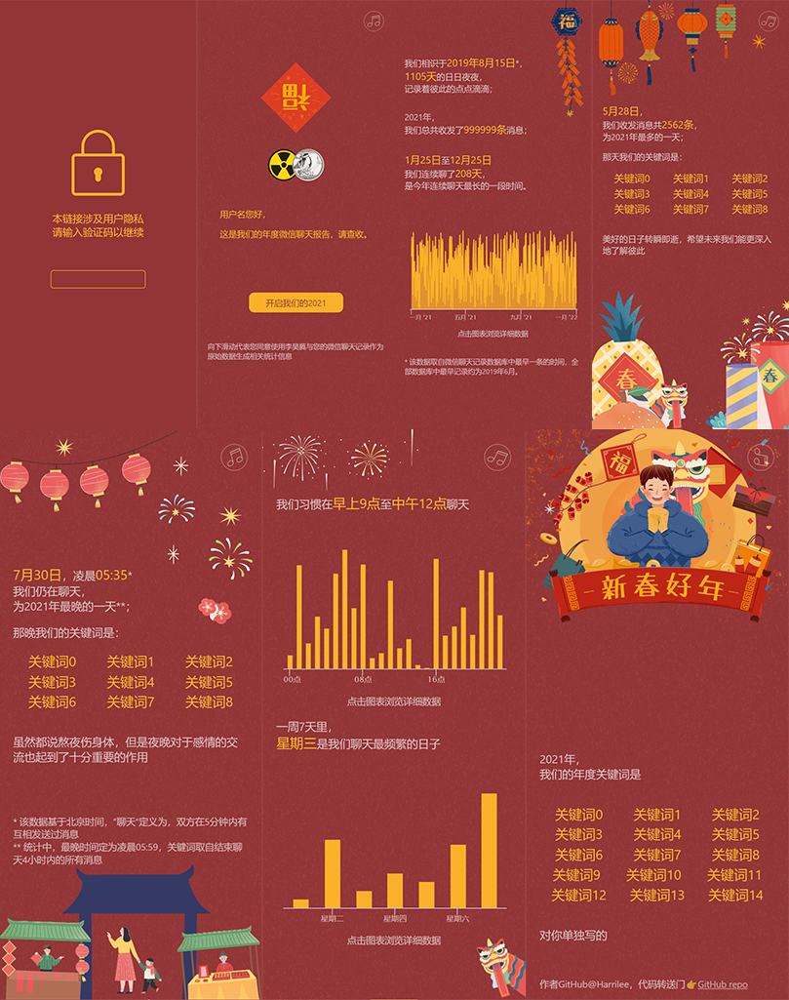

# 微信数据库年度报告

这是一个基于个人微信数据库，整理数据库主人与其好友的聊天统计信息。

本repository包括前端、后端、数据处理部分：
* 前端：使用React等框架，主要文件在`/src`
* 后端：使用Python/Flask，见`/backend`
* 数据处理：使用Python，见`/data_processing`

## 数据处理步骤
1. 运行`./data_processing/get_csv.py`，获取需要的消息和联系人列表；
该步骤需要微信数据库`EnMicroMsg.db`以及其密码；
2. 运行`./data_processing/process_messages.py`，自动处理所有联系人的信息，
该步骤会生成JSON缓存文件以及`./data_processing/manual_input.csv`和`./data_processing/my_wxid.txt`
3. 在`./data_processing/json`中手动输入祝福语
4. 运行`./data_processing/export.py`，生成验证码
5. 部署前端和后端